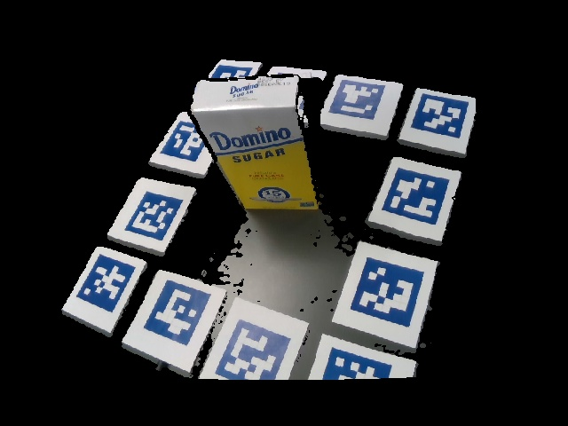

# LINEMOD toolkits

## Introduction

This repository contains tools to create a LINEMOD format dataset on customized items. The dataset can be used with various 6D object pose estimation projects such as singleshotpose. Ideally, if you have realsense cameras and have some experience with MeshLab or Blender, creating your customized dataset should be as easy as executing a few command line arguments.

This codes in this repository implement a raw 3D model acquisition pipeline through aruco markers and ICP registration. The raw 3D model obtained needs to be processed and noise-removed in a mesh processing software. After this step, there are functions to generate required labels in the LINEMOD style automatically. 

The codes are currently written for a single object of interest per frame. They can be modified to create dataset that has several items within a frame.
### License

This code is released under the MIT License (refer to the LICENSE file for details).


## Installation

Installation has been tested on a fresh install of Ubuntu 16.04 with Python 2.7

Step 1:

Upgrading any pre-install packages

```bash
sudo apt-get update
sudo apt-get upgrade
```
Step 2:

Install pip, a Python package manager, and update

```bash
sudo apt install python-pip
sudo -H pip2 install --upgrade pip
```
Step 3:

Install the required packages through apt-get

```bash
sudo apt-get install build-essential cmake git pkg-config libssl-dev
```

Step 4:

Install the required packages through pip

```bash
sudo pip install numpy Cython==0.19 pypng scipy scikit-learn open3d-python scikit-image open3d-python tqdm pykdtree opencv-python==3.3.0.10 opencv-contrib-python==3.3.0.10  trimesh==2.3.12
```
Note: the code was written for opencv ver > 3.0.0 and ver < 3.4.3, so the code should work out of the box if you
install opencv anew as instructed. However, if you have already installed opencv, the code
may need adjustment since different versions of opencv has slightly different API

Step 5:

Install librealsense and pyrealsense wrapper ( if you are using realsense camera F200, SR300)

Note: If you do not need to use python wrapper for the driver, please install the latest sdk which is easy to install, the python wrapper only supports the legacy version, which is not supported anymore and its installation manual is wrong.

(IMPORTANT): Check your kernel version and make sure you have 4.4 by running:

```bash
uname -r
```

If you install 16.04 recently, your kernel version is most likely higher than 4.4, (e.g. 4.8, 4.10, 4.15). In this case, you do not necessary need to downgrade your kernel version as 4.4 is still supported on 16.04.

If you do not know how to boot into the 4.4 kernel, you need to access grub and boot into 4.4 using the following step:

```bash
sudo apt-get install linux-image-generic
sudo nano /etc/default/grub && sudo update-grub
```

Comment out GRUB_HIDDEN_TIMEOUT and GRUB_TIMEOUT=0, write the file Ctrl+o and exit Ctrl+x, update-grub will then run. After update-grub the grub menu should not be hidden when rebooting.

Reboot your computer, go to advanced options, and boot the version starting with 4.4.

Note: make sure you boot with this kernel version when you install the driver and use the camera in the future.

Install librealsense

```bash
git clone https://github.com/IntelRealSense/librealsense
git checkout v1.12.1
```

Make sure that the depth camera is unplugged, and follow the installation steps in
(https://github.com/IntelRealSense/librealsense/blob/v1.12.1/doc/installation.md)

### Except

When you run ./scripts/patch-uvcvideo-16.04.simple.sh, you will get this error: /bin/bash: ./scripts/ubuntu-retpoline-extract-one: No such file or directory

There is no precaution for this, you need to wait until this error appear to fix this by:

```bash
cd ubuntu-xenial
cp debian/scripts/retpoline-extract-one scripts/ubuntu-retpoline-extract-one
```

And then rerun ./scripts/patch-uvcvideo-16.04.simple.sh (press y when ask if re-apply patch again)

You will also get other errors if you didn’t follow the preparation step. After the errors have been fixed, resume with the remaining steps provided by librealsense.

Install pyrealsense driver

```bash
git clone https://github.com/toinsson/pyrealsense
cd pyrealsense
sudo python setup.py install
```

## Create dataset on customized items

1. Color print the pdf with the correctly sized aruco markers in arucomarkers folder. Affix the markers surrounding the object of interest as shown in the picture.


2. Record an object sequence, record.py records an object video sequence after a countdown of 5 seconds. Please steadily move the camera to get different views of the object while maintaining that 2-3 markers are within the field of view of the camera at any time.

Assume the object being recorded is a sugar box.

```python
python record.py LINEMOD/sugar
```

Note that you need to put correct camera calibration parameters in config/DataAcquisitionParameters, if you are using the realsense camera, you can obtain those parameters by running 

```python
python getdepthintrinsic.py
```
If you are using other cameras, please put color images in JPEGImages folder and the aligned depth images in the depth folder. Color aligned to depth images are recommended since the code assumes that for each non-black keypoint detected in the color image, there is a corresponding depth reading in the depth image

3.  Register all frames and obtain a raw object mesh

```python
python compute_gt_poses.py LINEMOD/sugar
```
Poses as a 4*4 homogenous transformations are saved for all frame as a .npy file, and a raw sugar.ply are saved under LINEMOD/sugar

4. Process the mesh

The mesh needs to be processed to 1) remove noises that are not the object of interest. 2) to complete the missing side.

An video instruction is posted in [here] (https://youtu.be/BPX-j9xE2EQ)

Recent 6D pose estimation projects such as singleshotpose use mesh geometries purely for evaluation purpose and the texture information is not needed. Therefore, it's acceptable to "close holes" as shown in the video for planar areas. Also, for symmetrical objects, complete the shape manually by symmetry.

Make sure that the processed mesh is free of ANY isolated noise, and is NOT saved as a binary format (Basically, you should follow the video closely).

5. Create label files

When you have completed step 1-4 for all customized objects, run

```python
python compute_gt_poses.py all
```
This step creates labels of ground truth poses for all your images. 

## (Optional) Create additional files required by singleshotpose

1. Create train and test image directories

```python
python makeTrainTestfiles.py
```

2. Complete the path file

For each of the customized object, create an objectname.data file in the cfg folder

To get the object scale(max vertice distance), you can run

```python
python getmeshscale.py
``

This should be everything you need, please don't forget to update the camera calibration parameters in singleshotpose as well.

If you encounter any problems with the code, want to report bugs, etc. please contact me at fan.wang2[at]duke[dot]edu.


