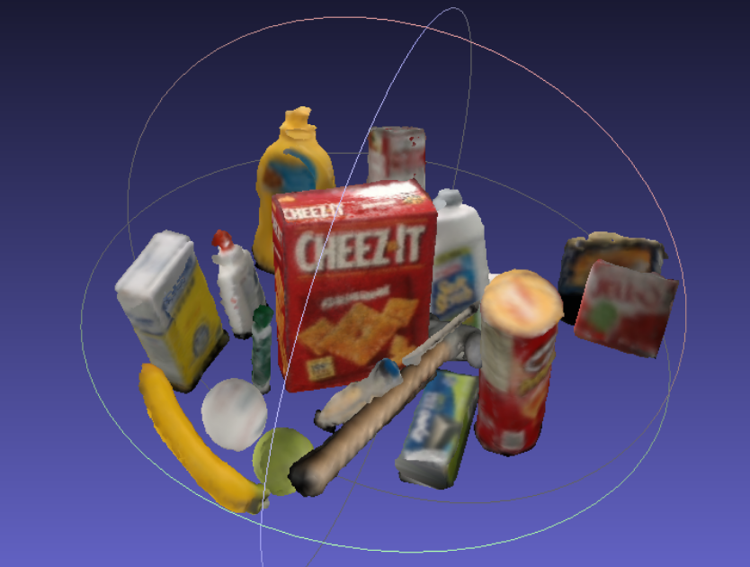
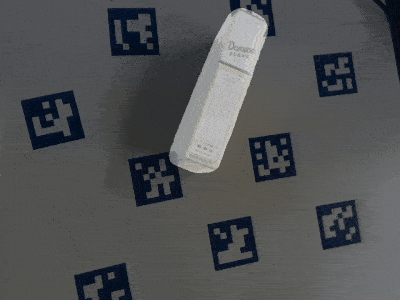
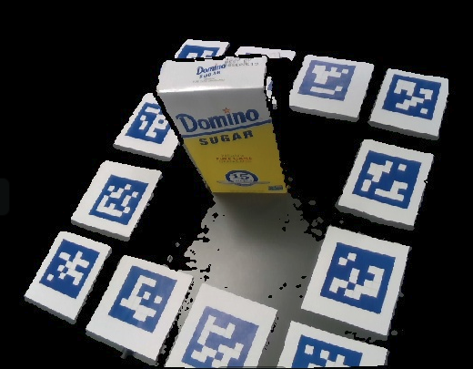
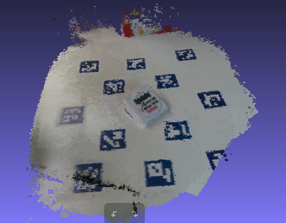
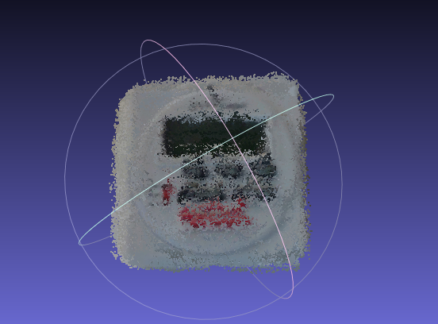

# Object Dataset Tools

## Introduction

This repository contains pure python scripts to create object masks, bounding box labels, and 3D reconstructed object mesh (.ply) for object sequences filmed with an RGB-D camera. This project can prepare training and testing data for various deep learning projects such as 6D object pose estimation projects singleshotpose, and many object detection (e.g., faster rcnn) and instance segmentation (e.g., mask rcnn) projects. Ideally, if you have realsense cameras and have some experience with MeshLab or Blender, creating your customized dataset should be as easy as executing a few command line arguments.

This codes in this repository implement a raw 3D model acquisition pipeline through aruco markers and ICP registration. The raw 3D model obtained needs to be processed and noise-removed in a mesh processing software. After this step, there are functions to generate required labels in automatically. 

The codes are currently written for a single object of interest per frame. They can be modified to create a dataset that has several items within a frame.

 

## Installation

[Installation](doc/installation.md) of this repository has been tested on a fresh install of Ubuntu 16.04 with Python 2.7, but should be compatible with Python 3 as well. Installations on a wide range of intel realsense drivers and their python wrappers are included.

## Create dataset on customized items

### 1. Preparation

**Color** print the pdf with the correctly sized aruco markers in the arucomarkers folder. Affix the markers surrounding the object of interest, as shown in the picture.



### 2. Record an object sequence

#### Option 1: Record with a realsense camera

The script is provided to record an object video sequence using a compatible realsense camera. Use record.py for legacy models and record2.py for librealsense SDK 2.0:  

```python
python record.py LINEMOD/OBJECTNAME
```
e.g.,

```python
python record.py LINEMOD/sugar
```

to record a sequence of a sugar box. By default, the script records for 40 seconds after a countdown of 5. You can change the recording interval or exit the recording by pressing "q". Please steadily move the camera to get different views of the object while maintaining that 2-3 markers are within the field of view of the camera at any time. 

Note that the project assumes all sequences are saved under the folder named "LINEMOD", use other folder names will cause an error to occur. 

If you use record.py to create your sequence, color images, depth aligned to color images, and camera parameters will be automatically saved under the directory of the sequence. 

#### Option 2: Use an existing sequence or record with other cameras

If you are using other cameras, please put color images (.jpg) in a folder named "JPEGImages" and the **aligned** depth images (uint16 pngs interpolated over a 8m range) in the "depth" folder. Please note that the algorithm assumes the depth images to be  aligned to color images. Name your color images in sequential order from 0.jpg, 1.jpg ... 600.jpg and the corresponding depth images as 0.png ... 600.png, you should also create a file intrinsics.json under the sequence directory and manually input the camera parameters in the format like below:

{"fx": 614.4744262695312, "fy": 614.4745483398438, "height": 480, "width": 640, "ppy": 233.29214477539062, "ppx": 308.8282470703125, "ID": "620201000292"}

If you don't know your camera's intrinsic, you can put a rough estimation in. All parameters required are fx, fy, cx, cy, where commonly fx = fy and equals to the width of the image and cx and cy is the center of the image. For example, for a 640 x 480 resolution image, fx, fy = 480, cx = 320, cy = 240. 

An example sequence can be download [HERE](https://drive.google.com/file/d/1qvKRW-jDPHSaJKkzttfXIoESN0O6Fksr/view?usp=sharing), create a directory named "LINEMOD", unzip the example sequence, and put the extracted folder (timer) in LINEMOD. 

### 3. Obtain frame transforms

Compute transforms for frames at the specified interval (interval can be changed in config/registrationParameters) against the first frame, save the transforms(4*4 homogenous transforms) as a numpy array (.npy).

```python
python compute_gt_poses.py LINEMOD/sugar
```

### 4. Register all frames and create a mesh for the registered scene.

```python
python register_scene.py LINEMOD/sugar
```
A raw registeredScene.ply will be saved under the specified directory (e.g., LINEMOD/sugar). The registeredScene.ply is a reconstruction of the scene that includes the table top, markers, and any other objects exposed during the scanning, with some level of noise removal. The generated mesh looks something like this:



Alternatively, if you want to save some effort removing all the unwanted background, you can try creating the mesh with register_segmented instead of register_scene.

```python
python register_segmented.py LINEMOD/sugar
```

Register_segmented should be able to automatically removes all the unwanted background. However, this script currently uses some ad hoc methods for segmenting the background, therefore you may need to tune some parameters for it to work with your object. The most important knob to tune is "MAX_RADIUS", which cuts off any depth reading whose Euclidean distance to the center of the aruco markers observed is longer than the value specified. This value is currently set at 0.2 m, if you have a larger object, you may need to increase this value to not cut off parts of your object. Result from running register_segmented looks something like this:



### 5. Process the registered pointcloud manually

The registered pointcloud needs to be processed to 
1) Remove background that is not of interest,
2) Perform surface reconstruction and complete the missing side or vice versa, 
3) Process the reconstructed mesh (you may need to cut parts off and recomplete the missing side),
4) Make sure that the processed mesh is free of ANY isolated noise.

The end product is a triangular mesh instead of the registered pointcloud generated by the algorithm.

You may find these YouTube tutorials useful: [Point cloud to mesh conversion](https://www.youtube.com/watch?v=38mt3kpsxd4), 
[Point Cloud to Mesh Reconstruction (MeshLab)](https://www.youtube.com/watch?v=lHKOJ1dbyJI), and [this](https://www.youtube.com/watch?v=BPX-j9xE2EQ) very basic one I recorded.

If you are creating the mesh as a by-product to obtain image masks, or use it for projects like singleshotpose. Only the exact mesh geometry is needed while the appearance is not useful. It's therefore acceptable to "close holes" as shown in the video for planar areas. Also, for symmetrical objects, complete the shape manually by symmetry. If you need the exact texture information for the missing side, you will need to film another sequence exposing the missing side and manually align 2 pointclouds. 


### 6. Create image masks and label files

When you have completed step 1-4 for all customized objects, run

```python
python create_label_files.py all
```
or 

```python
python create_label_files.py LINEMOD/sugar
```

This step creates image masks (saved under mask) as well as labels files (saved under labels) which are projections of the 3D bounding box of the object onto the 2D images. It also creates new mesh files (e.g., sugar.ply) whose AABBs are centered at the origin and are the same dimensions as the OBB. The mask files can be used for training and testing purposes for a deep learning project (e.g., mask-rcnn) 

### (Optional) Create additional files required by singleshotpose

If you create the mesh file for singleshot pose, you need to open those new mesh files in meshlab and save them again by unchecking the binary format option. Those meshes are used by singleshotpose for evaluation and pose estimation purpose, and singleshotpose cannot read mesh that is binary encoded.

Masks and labels created in step 6 are compatible with singleshotpose. Currently, class labels are assigned in a hacky way (e.g., by the order the folder is grabbed among all sequence folders), if you call create_label for each folder they will be assigned the same label, so please read the printout and change class label manually in create_label_files.py.

In addition, you need to create train and test images

```python
python makeTrainTestfiles.py
```

and create other required path files

For each of the customized object, create an objectname.data file in the cfg folder

To get the object scale(max vertice distance), you can run

```python
python getmeshscale.py
```

This should be everything you need for creating a customized dataset for singleshotpose, please don't forget to update the camera calibration parameters in singleshotpose as well.

### (Optional) Create bounding box labels for object detection projects

After you complete step 6 (generated image masks). Run:

```python
python get_BBs.py
```
This creates annotations.csv that contains class labels and bounding box information for all images under LINEMOD folder.


If you encounter any problems with the code, want to report bugs, etc. please contact me at faninedinburgh[at]gmail[dot]com.
